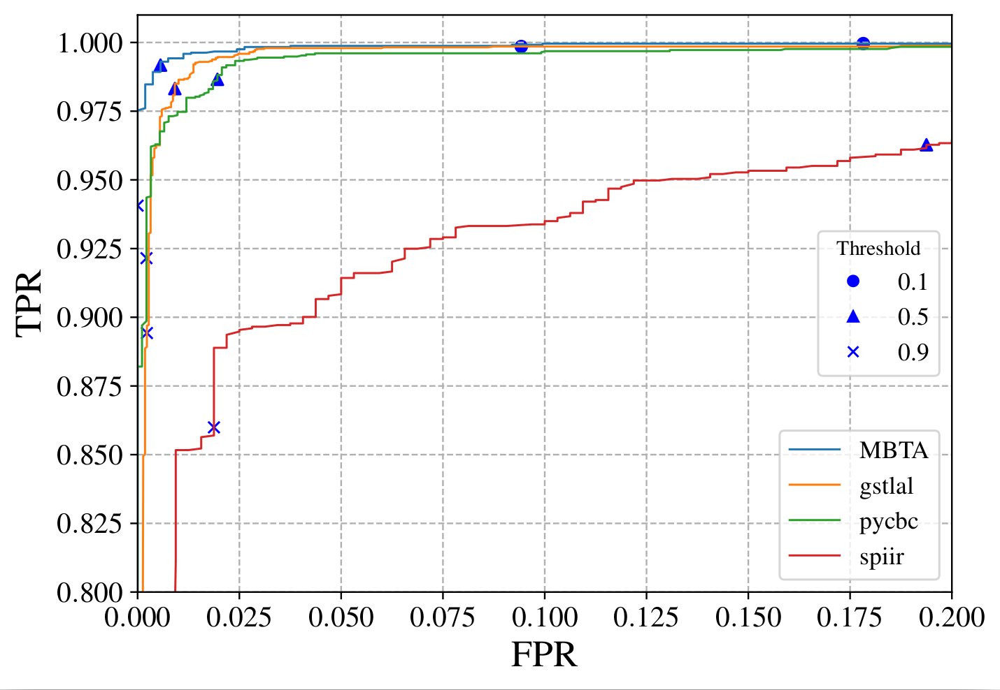
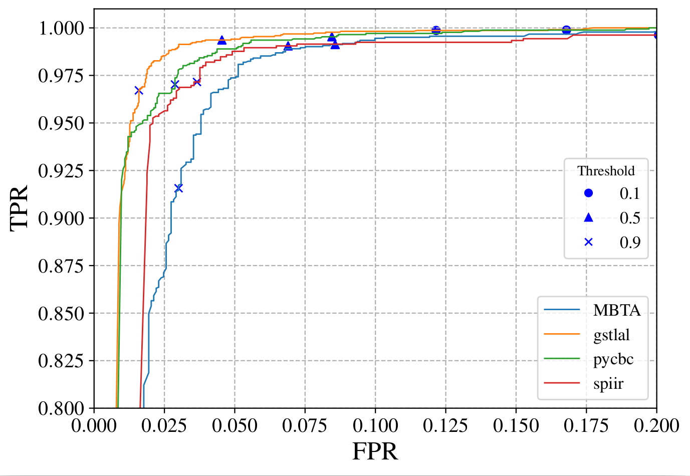
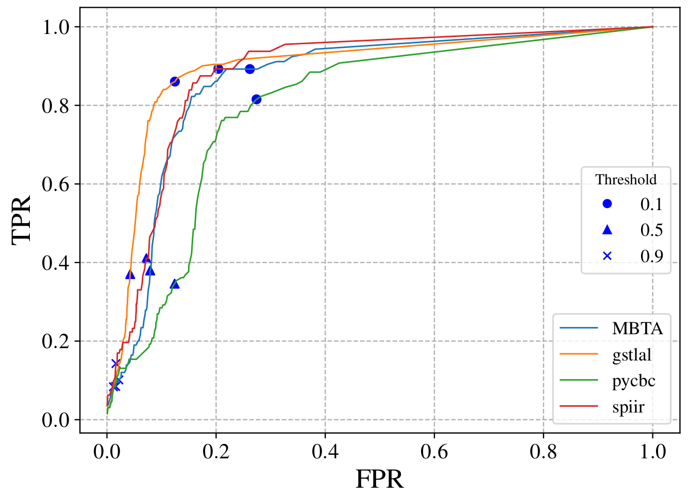

Peformance of EM-Bright data products on the O3 MDC
====================================================

The performance of EM-Bright data products across online CBC pipelines is shown below. 
Events with FAR threshold of FAR < 1/6*month were used in this analysis. For detailed description
of the Mock Data Challenge (MDC) and dataset used to produce these results, please 
refer to `arXiv:2308.04545 <https://arxiv.org/abs/2308.04545>`_.

   Fig: ROC curve showing performance of **HasNS** across four online CBC pipelines 

   Fig: ROC curve showing performance of **HasRemnant** across four online CBC pipelines 

   Fig: ROC curve showing performance of **HasMassGap** across four online CBC pipelines 